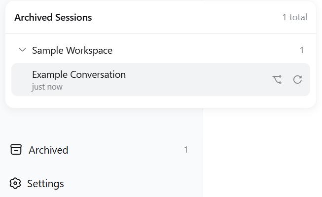

# dsh-archives

English | [中文](README.zh.md)

**Archived-session drawer at the bottom of the DSH web sidebar** — grouped by workspace, one-click restore & open, fork, or unarchive.

**Repository mirrors**

- GitHub: <https://github.com/chou109/dsh-archives>
- Gitee (mainland-China mirror — faster access there): <https://gitee.com/chill109/dsh-archives>

---

## 👤 If you are a human, read this

### What this plugin does

dsh-archives is a plugin for the [DeepSeek Harness](https://github.com/deepseek-ai/deepseek-harness) (DSH) web app.

DSH has a frustrating design: **once a session is archived, there is no way to view it or restore it** — it simply disappears from the sidebar. The log and data are still on disk, but the UI leaves no trace. This plugin adds an **"Archived (n)" button at the bottom of the sidebar** that lists every hidden session, grouped by workspace, so you can restore anything with one click.

### Screenshots



### Features

- Persistent **"Archived (n)" seat at the sidebar foot** — auto-hides when nothing is archived
- Panel **grouped by workspace**, groups collapsed by default, expansion state remembered
- **Click a session row** → restore & open the original session (live, no restart)
- **⿻ button** → fork a copy as a new session (the original stays archived)
- **↻ button** → move back to the sidebar without opening
- Bilingual UI (zh/en), inline error messages, click-outside to close

### Option 1: Deploy manually

Prerequisite: a machine with DSH installed and `dsh web` running.

1. **Get the plugin**: clone or download this repo (Gitee mirror recommended in mainland China):
   ```bash
   git clone https://gitee.com/chill109/dsh-archives.git    # mainland China, faster
   git clone https://github.com/chou109/dsh-archives.git    # international mirror
   ```
   You get the `dsh-archives` folder
2. **Copy it into DSH's plugin directory** (note: `profiles/node_modules`, **not** under `profiles/web`):
   - Windows: `copy /y dsh-archives C:\Users\<your user>\.dsh\profiles\node_modules\`
   - macOS / Linux: `cp -r dsh-archives "$HOME/.dsh/profiles/node_modules/"`
3. **Enable it**: edit `C:\Users\<your user>\.dsh\profiles\web\cordis.patch.yml` and append:
   ```yaml
   - insert:
       - id: archives
         name: 'dsh-archives'
   ```
4. **Restart**: stop the running `dsh web`, run `dsh web` again, open `http://127.0.0.1:3080`
5. **Confirm**: the "Archived (n)" button appears at the sidebar foot. If you have never archived a session, the button stays hidden — that is normal; archive one session first to try it

> If `$DSH_HOME` was customized, replace `C:\Users\<your user>\.dsh` with your actual DSH home directory.

### Option 2: Let an AI deploy it for you

The "If you are an AI agent, read this" section below is an **executable deployment manual written for AI** (one-command deploy, verification checklist, troubleshooting). You don't have to type any commands — just copy this prompt to any AI assistant (DeepSeek / GPT / Claude …):

```
Please deploy the dsh-archives plugin to my DeepSeek Harness Web.
Repo location: https://gitee.com/chill109/dsh-archives.git (recommended in mainland China)
               or https://github.com/chou109/dsh-archives.git
First read the README in the repo (especially the "If you are an AI agent" part),
then follow its one-command deploy steps, run the verification checklist,
and tell me the result. My DSH home directory is C:\Users\<your user>\.dsh.
```

The AI will do it all: locate the DSH directory → copy the plugin → write the config → restart → verify.

### Everyday usage

1. Click "Archived (n)" at the sidebar foot
2. Expand the workspace group you want
3. Pick an action: click a row = restore & open; ⿻ = fork; ↻ = unarchive only

### License

MIT — see [LICENSE](LICENSE).

---

## 🤖 If you are an AI agent, read this

This is an **executable deployment and operations manual**. Whenever you are asked to "deploy / install / use / debug dsh-archives", follow it as-is — paths and commands are exact, do not improvise.

### 0. What this is

A DSH **dual-half client plugin** — no build step, no third-party runtime dependencies.

| Path | Purpose |
|---|---|
| `package.json` | Package manifest; `name` **must equal** the client bundle id and the loader `name` |
| `lib/index.js` | **Host half**: `POST /archives/unarchive` endpoint |
| `lib/client.js` | **Browser half**: the sidebar UI (client bundle) |
| `tests/smoke-test.cjs` | Client smoke test (bundle load → apply registration → SSR render, 9 assertions) |
| `tests/host-test.mjs` | Host smoke test (route → unarchive → idempotence → validation, no external deps) |
| `docs/screenshot_*.png` | README screenshots |

### 1. Deploy

> **Get the repo** (if not already local): `git clone https://gitee.com/chill109/dsh-archives.git` (recommended in mainland China) or `git clone https://github.com/chou109/dsh-archives.git`, then `cd dsh-archives` before running the steps below.

**TL;DR — one command (Linux / macOS bash):**

```bash
DSH_HOME="${DSH_HOME:-$HOME/.dsh}"
cp -r ./dsh-archives "$DSH_HOME/profiles/node_modules/"
mkdir -p "$DSH_HOME/profiles/web"
cat >> "$DSH_HOME/profiles/web/cordis.patch.yml" <<'EOF'

# dsh-archives: archived sessions at the sidebar foot
- insert:
    - id: archives
      name: 'dsh-archives'
EOF
```

**TL;DR — one command (Windows PowerShell):**

```powershell
$dsh = if ($env:DSH_HOME) { $env:DSH_HOME } else { "$env:USERPROFILE\.dsh" }
Copy-Item -Recurse .\dsh-archives "$dsh\profiles\node_modules\"
Add-Content "$dsh\profiles\web\cordis.patch.yml" @"

# dsh-archives: archived sessions at the sidebar foot
- insert:
    - id: archives
      name: 'dsh-archives'
"@
```

**Full procedure (exact paths):**

1. **Locate DSH home**: `$DSH_HOME` (default `~/.dsh`, e.g. `C:\Users\<user>\.dsh` on Windows).
2. **Copy the plugin** into the dependency directory. Note the `web` profile's deps live **one level above** the profile dir (`$DSH_HOME/profiles/node_modules/`, flat hoisted layout), not inside `profiles/web/node_modules`:
   ```bash
   cp -r dsh-archives "$DSH_HOME/profiles/node_modules/"
   ```
3. **Enable the plugin**: append to `$DSH_HOME/profiles/web/cordis.patch.yml` (create the file with this content if it does not exist):
   ```yaml
   # Your patch layer for this dsh profile.
   - insert:
       - id: archives
         name: 'dsh-archives'
   ```
   `id` is an arbitrary loader row name; `name` **must** equal the package name (`dsh-archives`).
4. **Restart**: stop the running `dsh web` process, run `dsh web` again, open `http://127.0.0.1:3080`.

### 2. Verification checklist (all four must pass)

```bash
# Linux/macOS
curl -s -o /dev/null -w "bundle=%{http_code}\n" http://127.0.0.1:3080/plugins/dsh-archives/client.js  # expect bundle=200
curl -s -o /dev/null -w "route=%{http_code}\n"  http://127.0.0.1:3080/archives/unarchive             # expect route=405
```

```powershell
# Windows PowerShell
(Invoke-WebRequest http://127.0.0.1:3080/plugins/dsh-archives/client.js -UseBasicParsing).StatusCode  # 200
(Invoke-WebRequest http://127.0.0.1:3080/archives/unarchive -UseBasicParsing).StatusCode              # 405
```

The other two: `window.__DSH_BOOT__` in the served page source contains `dsh-archives`; the "Archived (n)" button appears at the sidebar foot (requires at least one archived session to be visible).

### 3. Debugging

| Symptom | Diagnosis |
|---|---|
| bundle 404 | Plugin not in `$DSH_HOME/profiles/node_modules/`, or `name:` in `cordis.patch.yml` mismatches the directory/package name → fix and restart |
| route 404/500 | Host half did not load → `dsh --profile web --dump-config` to confirm the `archives` row is composed |
| bundle 200 but no button | Open the browser console (F12): a component render crash is **silently abdicated** by the slot machinery, so the console error is the only clue; confirm the page is refreshed |
| API returns 500 | The host log prints `[dsh-archives] unarchive failed: ...` (server console) |
| Panel data wrong | Check `global.archivedSessionIds` in `$DSH_HOME/storages/workspace.json` |
| Code edits not taking effect | The client bundle is read per request: **UI changes only need a page refresh**; host changes (`lib/index.js`) need a restart |

**Live frame check** (verify the unarchive push path): connect to `ws://127.0.0.1:3080/api/events.host`; after one unarchive you should receive a `host/archived-sessions-changed` frame carrying the full updated archive set.

### 4. Operations (interface & behavior contract)

**HTTP endpoint**

| Item | Value |
|---|---|
| Path | `POST /archives/unarchive` |
| Body | `{"sessionId": "session-..."}` |
| Success | `200 {"ok":true,"changed":true}` (removed); or `{"ok":true,"changed":false}` (was not archived — idempotent) |
| Bad request | `400` (body not JSON / invalid sessionId) |
| Method error | `405` (not POST) |
| Server error | `500` |

**UI actions**

| Action | Effect |
|---|---|
| Click session row | Restore & open: unarchive → subscribe to `ctx.workspaces.list` until the set syncs → `sessions.open` |
| ⿻ button | `sessions.fork` as a new session and open the child (the original stays archived) |
| ↻ button | Unarchive only, do not open |
| Click group header | Collapse/expand; state persisted to localStorage (key `dsh.archived.panel.expanded.v1`) |
| Click outside the panel | Close the panel |

**Data contract**

- The archive set persists at `global.archivedSessionIds` in `$DSH_HOME/storages/workspace.json`
- Archived sessions stay in `session.list` (only hidden from grouping views); log and accounting slot are untouched
- Directly `open()`ing a still-archived session is cleared immediately by the runtime (by design) — so "restore" must unarchive first, wait for the set to sync, then open

### 5. How unarchive works

```
POST /archives/unarchive {sessionId}
  └─ host: workspaceRegistry.enqueueOperation → requireState → setState
       └─ workspace.domain.global.set (disk + memory + domain/changed event)
            └─ api-proxy observes the event → pushes host/archived-sessions-changed
                 └─ client: installArchived → useWorkspaces updates → the panel drops the session
```

It uses the registry's own write path (serialized on its operation tail), exactly like built-in operations: live across tabs, survives restarts.

### 6. Modifying / extending (do & don't)

- ✅ The bundle id in `window.__ModuleLoader__.load({id, ...})` **must equal** `package.json` `name`
- ✅ `useSessions` / `useWorkspaces` **require a selector** — the engine's `bindSnapshotSelector` does not default a missing one (crashes with `w is not a function`)
- ✅ `host/archived-sessions-changed` is a **framework constant** — never rename it
- ✅ The restore flow waits for the archive set to sync before `open()`, so the projection sweep cannot clear the fresh selection
- ❌ Do not `open()` a still-archived session directly
- UI changes need only a refresh; host changes need a restart; renaming the package requires updating the bundle id, the directory, and `cordis.patch.yml` together

### 7. Testing

```bash
node tests/smoke-test.cjs   # client smoke test; needs real React from a DSH profile — set DSH_PROFILE_NODE_MODULES
node tests/host-test.mjs    # host smoke test; no external dependencies
```

### 8. Known limitations

- Directly `open()`ing an archived session is cleared by the runtime (by design); use **restore & open** or **fork**
- Archived sessions are excluded from sidebar content search (framework behavior)
- Rail (collapsed) sidebar shows the icon only
- The panel is a fixed-position overlay; it overlaps the Cordis plugin panel if both are open
- Built and verified against dsh **0.1.0-rc.6**; adapt if slot/service names change after upgrading

---

## License

MIT — see [LICENSE](LICENSE).
