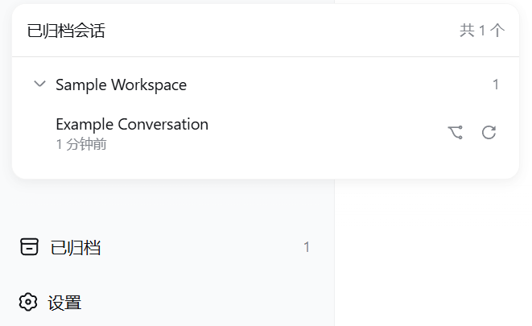

# dsh-archives

[English](README.md) | 中文

**DSH Web 侧边栏底部的归档会话抽屉** —— 按工作区分组折叠，一键恢复并打开、复制为新会话或移回侧边栏。

**仓库镜像**

- GitHub：<https://github.com/chou109/dsh-archives>
- Gitee（中国大陆仓库，国内访问更快）：<https://gitee.com/chill109/dsh-archives>

---

## 👤 如果你是人类，请看这里

### 这个插件是干什么的

dsh-archives 是 [DeepSeek Harness](https://github.com/deepseek-ai/deepseek-harness)（DSH）Web 界面的一个插件。

DSH 有个让人头疼的设计：**会话一旦归档，就再也看不到、也找不到恢复入口**——它只是从侧边栏里消失，日志和数据都还在磁盘上，但界面上没有任何痕迹。本插件在侧边栏**底部**加了一个 **「已归档 (n)」按钮**，把被藏起来的会话全部列出来、按工作区分组，想恢复随时一键搞定。

### 效果展示



### 功能一览

- 侧边栏底部常驻「已归档 (n)」入口，没有归档会话时自动隐藏
- 面板按工作区分组，组默认折叠，展开状态自动记住
- **点击会话行** → 恢复并打开原会话（实时生效，无需重启）
- **⿻ 按钮** → 复制为新会话并打开（原会话保留在已归档）
- **↻ 按钮** → 仅移回侧边栏，不打开
- 中英双语文案、操作失败内联提示、点击面板外部自动关闭

### 方式一：手动部署

前提：你有一台装好 DSH 的电脑，`dsh web` 能正常打开。

1. **拿到插件**：克隆或下载本仓库（国内推荐 Gitee 镜像），得到 `dsh-archives` 文件夹
2. **复制到 DSH 插件目录**（注意：是 `profiles/node_modules`，不是 `profiles/web` 下）：
   - Windows：`copy /y dsh-archives C:\Users\<你的用户名>\.dsh\profiles\node_modules\`
   - macOS / Linux：`cp -r dsh-archives "$HOME/.dsh/profiles/node_modules/"`
3. **启用插件**：编辑 `C:\Users\<你的用户名>\.dsh\profiles\web\cordis.patch.yml`，在末尾追加：
   ```yaml
   - insert:
       - id: archives
         name: 'dsh-archives'
   ```
4. **重启**：停掉正在运行的 `dsh web`，重新执行 `dsh web`，浏览器打开 `http://127.0.0.1:3080`
5. **确认成功**：侧边栏底部出现「已归档 (n)」按钮。如果你还没有归档过任何会话，按钮不会显示——这是正常的，先归档一个会话试试

> 如果 `$DSH_HOME` 被改过，把上面的 `C:\Users\<你的用户名>\.dsh` 换成你实际的 DSH 主目录。

### 方式二：让 AI 帮你部署

本 README 的「如果你是 AI，请读这里」部分是一份**给 AI 看的可执行部署手册**（含一键部署命令、验证清单、排障表）。你不需要自己敲命令——把下面这段话复制给任意 AI 助手（DeepSeek / GPT / Claude 等）即可：

```
请帮我把 dsh-archives 插件部署到我的 DeepSeek Harness Web。
仓库位置：<仓库本地路径，或 GitHub/Gitee 地址>
请先阅读仓库里的 README（重点看「如果你是 AI，请读这里」部分），
然后按其中的一键部署步骤执行，跑完验证清单，
最后告诉我部署结果。我的 DSH 主目录是 <例如 C:\Users\你的用户名\.dsh>。
```

AI 会自己完成：定位 DSH 目录 → 复制插件 → 写入配置 → 重启 → 验证。

### 日常使用

1. 点侧边栏底部的「已归档 (n)」
2. 展开对应工作区的分组
3. 选操作：点会话行 = 恢复并打开；⿻ = 复制为新会话；↻ = 仅移回侧边栏

### 许可

MIT，见 [LICENSE](LICENSE)。

---

## 🤖 如果你是 AI，请读这里

这是一份**可执行的部署与操作手册**。当有人要求你"部署 / 安装 / 使用 / 调试 dsh-archives"时，直接按本手册执行——路径与命令都是精确的，不要自行发挥。

### 0. 这是什么

DSH **双 half** 客户端插件包：无构建步骤、无第三方运行时依赖。

| 路径 | 作用 |
|---|---|
| `package.json` | 包清单；`name` **必须等于**客户端 bundle id 和加载器 `name` |
| `lib/index.js` | **host half**：`POST /archives/unarchive` 取消归档接口 |
| `lib/client.js` | **browser half**：侧边栏 UI（客户端 bundle） |
| `tests/smoke-test.cjs` | client 冒烟测试（bundle 加载 → apply 注册 → SSR 渲染，9 项断言） |
| `tests/host-test.mjs` | host 冒烟测试（路由 → 取消归档 → 幂等 → 校验，无外部依赖） |
| `docs/screenshot_*.png` | README 截图 |

### 1. 部署

**TL;DR —— 一条命令（Linux / macOS bash）：**

```bash
DSH_HOME="${DSH_HOME:-$HOME/.dsh}"
cp -r ./dsh-archives "$DSH_HOME/profiles/node_modules/"
mkdir -p "$DSH_HOME/profiles/web"
cat >> "$DSH_HOME/profiles/web/cordis.patch.yml" <<'EOF'

# dsh-archives: archived sessions at the sidebar foot
- insert:
    - id: archives
      name: 'dsh-archives'
EOF
```

**TL;DR —— 一条命令（Windows PowerShell）：**

```powershell
$dsh = if ($env:DSH_HOME) { $env:DSH_HOME } else { "$env:USERPROFILE\.dsh" }
Copy-Item -Recurse .\dsh-archives "$dsh\profiles\node_modules\"
Add-Content "$dsh\profiles\web\cordis.patch.yml" @"

# dsh-archives: archived sessions at the sidebar foot
- insert:
    - id: archives
      name: 'dsh-archives'
"@
```

**完整步骤（精确路径）：**

1. **定位 DSH 主目录**：`$DSH_HOME`（默认 `~/.dsh`，Windows 如 `C:\Users\<用户>\.dsh`）。
2. **复制插件**到依赖目录。注意 `web` profile 的依赖在**上级目录**（`$DSH_HOME/profiles/node_modules/`，扁平 hoisted 布局），不是 `profiles/web/node_modules`：
   ```bash
   cp -r dsh-archives "$DSH_HOME/profiles/node_modules/"
   ```
3. **启用插件**：向 `$DSH_HOME/profiles/web/cordis.patch.yml` 末尾追加（文件不存在就按此内容新建）：
   ```yaml
   # Your patch layer for this dsh profile.
   - insert:
       - id: archives
         name: 'dsh-archives'
   ```
   `id` 是加载器行名（可自定义）；`name` **必须**与包名一致（`dsh-archives`）。
4. **重启**：停掉运行中的 `dsh web` 进程，重新执行 `dsh web`，浏览器打开 `http://127.0.0.1:3080`。

### 2. 验证清单（四项全过才算成功）

```bash
# Linux/macOS
curl -s -o /dev/null -w "bundle=%{http_code}\n" http://127.0.0.1:3080/plugins/dsh-archives/client.js  # 期望 bundle=200
curl -s -o /dev/null -w "route=%{http_code}\n"  http://127.0.0.1:3080/archives/unarchive             # 期望 route=405
```

```powershell
# Windows PowerShell
(Invoke-WebRequest http://127.0.0.1:3080/plugins/dsh-archives/client.js -UseBasicParsing).StatusCode  # 200
(Invoke-WebRequest http://127.0.0.1:3080/archives/unarchive -UseBasicParsing).StatusCode              # 405
```

另两项：服务页面源码中 `window.__DSH_BOOT__` 的 entries 包含 `dsh-archives`；侧边栏底部出现「已归档 (n)」按钮（需至少有一个归档会话才显示）。

### 3. 调试

按症状查对应路径：

| 症状 | 排查 |
|---|---|
| bundle 404 | 插件不在 `$DSH_HOME/profiles/node_modules/`，或 `cordis.patch.yml` 的 `name:` 与目录/包名不一致 → 修正后重启 |
| 路由 404/500 | host half 未加载 → `dsh --profile web --dump-config` 看组合配置里有没有 `archives` 行 |
| bundle 200 但没有按钮 | 打开浏览器控制台（F12）：组件渲染崩溃会被槽位机制**静默摘除**，控制台报错是唯一线索；确认页面已刷新 |
| 接口返回 500 | host 日志会输出 `[dsh-archives] unarchive failed: ...`（服务器控制台） |
| 面板数据不对 | 核对 `$DSH_HOME/storages/workspace.json` 的 `global.archivedSessionIds` |
| 改代码不生效 | client bundle 按请求实时读取：**UI 改动只刷新页面**；host 改动（`lib/index.js`）需重启 |

**实时帧验证**（确认取消归档的推送链路）：连接 `ws://127.0.0.1:3080/api/events.host`，发起一次取消归档后应收到 `host/archived-sessions-changed` 帧，负载为更新后的完整归档集合。

### 4. 操作方式（接口与行为契约）

**HTTP 接口**

| 项 | 值 |
|---|---|
| 路径 | `POST /archives/unarchive` |
| 请求体 | `{"sessionId": "session-..."}` |
| 成功 | `200 {"ok":true,"changed":true}`（已移除）；或 `{"ok":true,"changed":false}`（本就没归档，幂等） |
| 参数错误 | `400`（body 非 JSON / sessionId 非法） |
| 方法错误 | `405`（非 POST） |
| 服务端错误 | `500` |

**UI 操作**

| 操作 | 效果 |
|---|---|
| 点击会话行 | 恢复并打开：取消归档 → 订阅 `ctx.workspaces.list` 等归档集合同步 → `sessions.open` |
| ⿻ 按钮 | `sessions.fork` 复制为新会话并打开子会话（原会话仍归档） |
| ↻ 按钮 | 仅取消归档，不打开 |
| 点组头 | 折叠/展开；状态存 localStorage（键 `dsh.archived.panel.expanded.v1`） |
| 点面板外部 | 关闭面板 |

**数据契约**

- 归档集合持久化于 `$DSH_HOME/storages/workspace.json` → `global.archivedSessionIds`
- 归档会话仍留在 `session.list`（只是从分组视图隐藏），日志与记账槽位不变
- 直接 `open()` 仍归档的会话会被运行时立即清除选中（设计如此）——所以「恢复」必须先取消归档、等集合同步，再打开

### 5. 工作原理（取消归档链路）

```
POST /archives/unarchive {sessionId}
  └─ host: workspaceRegistry.enqueueOperation → requireState → setState
       └─ workspace.domain.global.set（写盘 + 更新内存 + 发 domain/changed）
            └─ api-proxy 收到事件 → 推送 host/archived-sessions-changed 帧
                 └─ client: installArchived → useWorkspaces 更新 → 面板自动移除该会话
```

走 registry 自身写路径（串行于 operation tail），与界面内置操作完全同源：多标签实时同步、重启不丢。

### 6. 修改与扩展（注意事项）

- ✅ `window.__ModuleLoader__.load({id, ...})` 的 bundle id **必须等于** `package.json` 的 `name`
- ✅ `useSessions` / `useWorkspaces` **必须传选择器**——引擎的 `bindSnapshotSelector` 不兜底缺省选择器（缺选择器会以 `w is not a function` 崩溃）
- ✅ `host/archived-sessions-changed` 是**框架常量**，永远不要改名
- ✅ 恢复流程先等集合同步再 `open()`，避免投影清理误清新选中的会话
- ❌ 不要直接 `open()` 仍归档的会话
- 改 UI 只刷新；改 host 需重启；改包名要同步改 bundle id / 目录 / `cordis.patch.yml` 三处

### 7. 测试

```bash
node tests/smoke-test.cjs   # client 冒烟测试；需要 DSH profile 里的真实 react —— 设置 DSH_PROFILE_NODE_MODULES
node tests/host-test.mjs    # host 冒烟测试；无外部依赖
```

### 8. 已知限制

- 直接 `open()` 归档会话会被运行时清除选中（设计如此）；请用「恢复并打开」或「复制」
- 归档会话不参与侧边栏内容搜索（框架行为）
- 侧边栏收起（rail）模式只显示图标
- 面板是固定定位浮层，与 Cordis 插件面板同时打开会重叠
- 针对 dsh **0.1.0-rc.6** 开发验证；升级 DSH 后若槽位/服务名变更需适配

---

## 许可

MIT，见 [LICENSE](LICENSE)。
